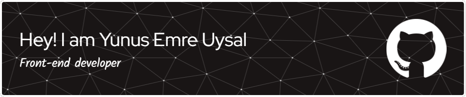

  

</td><td valign="top" width="50%">

  

  

   

### 
A passionate frontend developer from Turkey. I've completed my frontend development training and am currently diving into backend development. My current goal is to become a MERN stack developer
  
  

- 🌱 Frontend with Next.js, React and TypeScript;  
  

- 💬 Backend with Node.js, Express and MongoDB.  
  

- ❓ Ask me about anything that i can teach or got lesson about MERN stack and related technologies  
  

- ⚡ Fun fact: I use tabs over spaces  
  

   

## My Skill Set  
<table><tr><td valign="top" width="33%">

### Programming Language  

  
  
  
  

</td><td valign="top" width="33%">

### Frontend Frameworks & Libraries  

  
  
  
  

</td><td valign="top" width="33%">

### Backend Technologies  

  
  
  

</td></tr></table>  

   

<table><tr><td valign="top" width="33%">

### Styling & CSS Frameworks  

  
  
  
  
  
  

</td><td valign="top" width="33%">

### Databases  

  
  
  
  
  

</td><td valign="top" width="33%">

### Version Control & Other Tools  

  
  

</td></tr></table>  

   

## Github Stats  

 

### ✍️ Random Dev Quote

<!-- Proudly created with GPRM ( https://gprm.itsvg.in ) -->
